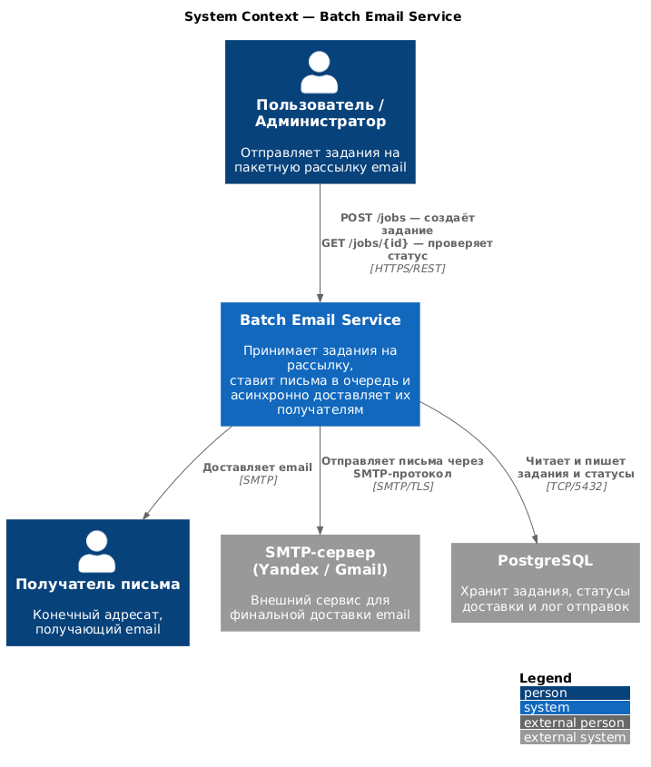

# Практическая работа №9
## Архитектурное проектирование с ИИ в нотации C4

**Тема:** Сервис для пакетной отправки email (Batch Email Service)  
**Тема №17 из Приложения А**

---

## Problem Statement

Batch Email Service — это система для массовой и надёжной отправки email-сообщений. Пользователи (администраторы, маркетологи) создают задания через REST API, указывая список получателей и шаблон письма. API Gateway принимает и валидирует запрос, сохраняет задание в PostgreSQL и публикует его в очередь Redis Streams. Email Worker асинхронно забирает задания из очереди и отправляет письма через внешний SMTP-сервер (Yandex Mail / Gmail), обновляя статус доставки в базе данных. Система взаимодействует с внешними сервисами: SMTP-сервером для финальной доставки писем и PostgreSQL для персистентного хранения данных.

---

## Диаграммы C4

### C1 — Контекст (Context)

[Исходный код: context.puml](diagrams/context.puml)

> Рендер: вставьте содержимое `context.puml` на сайте [plantuml.com/ru/](https://www.plantuml.com/plantuml/uml/) и сохраните как `context.png`

### C2 — Контейнеры (Containers)

[Исходный код: container.puml](diagrams/container.puml)

### C3 — Компоненты (Components) — API Gateway

[Исходный код: component.puml](diagrams/component.puml)

---

## Таблица критического анализа

### Диаграмма C1 (Контекст)

| Аспект | Что сгенерировал ИИ | Что исправлено вручную | Обоснование исправления |
|--------|---------------------|------------------------|-------------------------|
| Участники системы | ИИ добавил только одного пользователя и SMTP | Добавлен отдельный актор «Получатель письма» | Получатель — независимый актор, не инициирует запросы, но является конечным потребителем системы |
| Внешние системы | ИИ не включил PostgreSQL в контекст | Добавлен PostgreSQL как внешняя система | На уровне контекста важно показать все внешние зависимости системы |
| Описания связей | ИИ использовал обобщённые «sends», «uses» | Заменены на конкретные протоколы и методы API | Нотация C4 рекомендует конкретизировать метод взаимодействия |
| Заголовок | Отсутствовал | Добавлен `title` и `LAYOUT_WITH_LEGEND()` | Улучшает читаемость и соответствие стандарту C4-PlantUML |

### Диаграмма C2 (Контейнеры)

| Аспект | Что сгенерировал ИИ | Что исправлено вручную | Обоснование исправления |
|--------|---------------------|------------------------|-------------------------|
| Технологии | ИИ написал «Python» без уточнения фреймворка | Уточнено: FastAPI, asyncio, Redis Streams | C4 рекомендует указывать конкретные технологии в контейнерах |
| Redis | ИИ описал Redis просто как «cache» | Исправлено на «Redis Streams» с описанием роли очереди | Redis используется именно как очередь, а не кэш — разные паттерны использования |
| Порты | Отсутствовали | Добавлены порты в подписи связей (5432, 6379, 465) | Помогает при диагностике сетевых политик в Kubernetes |
| Граница системы | ИИ не использовал `System_Boundary` | Добавлен `System_Boundary` для группировки контейнеров | Визуально отделяет внутренние компоненты от внешних зависимостей |

### Диаграмма C3 (Компоненты — API Gateway)

| Аспект | Что сгенерировал ИИ | Что исправлено вручную | Обоснование исправления |
|--------|---------------------|------------------------|-------------------------|
| Auth | ИИ не включил аутентификацию | Добавлен `Auth Middleware` с API-ключом | Без авторизации сервис открыт для злоупотреблений — критически важный компонент |
| Метрики | Отсутствовали | Добавлен компонент `Metrics Endpoint` | Необходим для практики №12 (мониторинг) и соответствия требованиям задания |
| Слои | ИИ смешал роутер и бизнес-логику | Разделено на Router, JobService, Repository | Паттерн разделения ответственности (SRP): роутер — HTTP, сервис — логика, репозиторий — данные |
| Описания компонентов | Обобщённые | Конкретизированы с указанием библиотек (SQLAlchemy async, FastAPI Middleware) | Помогает разработчику сразу понять стек реализации |

---

## Вывод

ИИ-ассистент (Claude) оказался полезен для **быстрой генерации скелета диаграммы** в нотации C4-PlantUML: за несколько секунд он создаёт синтаксически корректный код, включает основные элементы и связи. Однако без ручной доработки диаграммы страдают от:

1. **Поверхностного описания** — отсутствуют технологии, порты, конкретные протоколы.
2. **Пропуска архитектурных слоёв** — ИИ не добавил аутентификацию и мониторинг.
3. **Несоответствия нотации** — смешение ответственности компонентов, отсутствие границ системы.

**Итог:** ИИ подходит для проектирования архитектуры как «черновик первого приближения», но финальная диаграмма требует экспертной проверки и доработки. Примерное соотношение: 60% генерировал ИИ, 40% доработано вручную.
